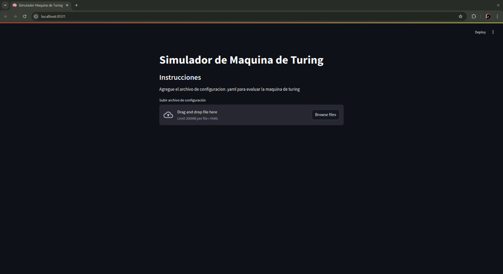

# Proyecto 3 - Teoría de la computación
Este Proyecto está orientado en la construcción de dos máquinas de Turing donde una es reconocedora y otra es alteradora

## Dependencias 
Para poder ejecutar este proyecto necesitarás las siguientes dependencias que se encuentran dentro de un archivo.txt 

```javascript
pip install -r requirements.txt
```
## Deployment
Después de tener las dependencias instaladas, estás listo para poder ejecutar el programa con el siguiente comando
```javascript
streamlit run main.py
```
Si es que encuentras un problema con este comando también puedes intentar utilizar este otro
```javascript
python -m streamlit run main.py
```

## Instrucciones de uso
Ahora que ya lograste ejecutar el programa puedes subir tus archivos .yaml en la ventana que sé desplegó que se ve algo de esta manera. 



## Video de demostración
[Video]([https://www.youtube.com/watch?v=ID_DEL_VIDEO](https://www.youtube.com/watch?v=YWQbu5Da_F4))

